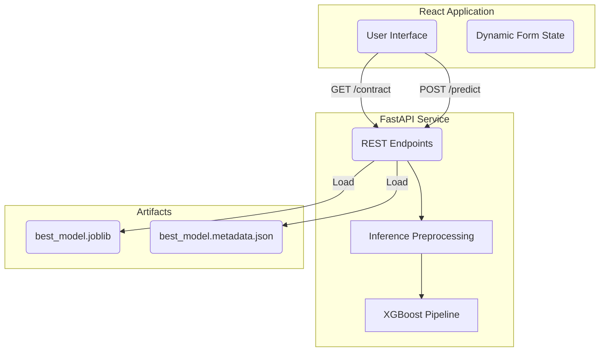

# Used Bike Price Predictor

A production-ready Machine Learning inference service and interactive web application that predicts the resale value of used motorcycles. 

This repository implements a full-stack, end-to-end ML lifecycle: from data cleaning and pipeline training to a FastAPI backend serving a self-aware predictive model, driven by a React frontend.

---

## 🎯 Features

* **Metadata-Driven Inference:** The backend prevents statistical extrapolation by tracking the exact numeric bounds (min/max) and categorical bounds of the data it was trained on.
* **Self-Aware Prediction Quality:** Instead of blindly returning a number, the API explicitly returns a `prediction_quality` signal (e.g., indicating out-of-distribution inputs).
* **Transparent Clamping:** Inputs beyond the model's known operating region are safely clamped before inference, generating clear warnings for the client.
* **Schema-Driven UI Constraints:** The React frontend automatically shapes itself around the API's constraints (`/contract`), eliminating drift between client and server validation logic.
* **Synchronized ML Loading:** Thread-safe, double-checked locking guarantees safe model initialization within FastAPI's AnyIO threadpool.

---

## 🏗️ Architecture



### Technology Stack
* **Machine Learning:** `scikit-learn`, `xgboost`, `pandas`, `numpy`
* **Backend:** `FastAPI`, `uvicorn`, `pydantic`
* **Frontend:** `React 19`, `Vite`, `TailwindCSS 4`, `shadcn/ui`, `framer-motion`
* **Testing:** `pytest`, `TestClient`

---

## 📁 Repository Structure

```text
used-bike-price/
├── data/                       # Raw datasets (e.g., Used_Bikes.csv)
├── frontend/                   # React SPA
│   ├── src/                    # UI Components and App logic
│   └── package.json            # Node dependencies
├── models/                     # Compiled ML artifacts
│   ├── best_model.joblib       # Serialized Pipeline
│   └── best_model.metadata.json# Runtime bounds and OOD constraints
├── outputs/                    # Training evaluation metrics & plots
├── src/                        # Core Python package
│   ├── api.py                  # FastAPI service routing & endpoints
│   ├── contracts.py            # Shared validation constants
│   ├── data_loader.py          # Data ingestion utilities
│   ├── evaluation.py           # Model scoring and charting
│   ├── feature_engineering.py  # Derived features (e.g. kms_per_year)
│   ├── main.py                 # CLI entry point (train / predict)
│   ├── models.py               # ML training pipelines and hyperparameter tuning
│   └── preprocessing.py        # Data cleaning and outlier removal
└── tests/                      # Pytest suite
```

---

## 🚀 Workflows

### 1. Training Workflow
Run the full ML pipeline to clean data, engineer features, evaluate multiple algorithms (Linear, Ridge, Lasso, RF, GBM, XGBoost), tune the best performer, and serialize the artifacts.

```bash
python src/main.py
```
This generates the `best_model.joblib` and `best_model.metadata.json` which the API requires to boot.

### 2. Inference Workflow
The backend exposes the trained model over REST. The API actively defends the model against out-of-distribution (OOD) queries by applying bounds-checking during `prepare_inference_input()`.

```bash
uvicorn src.api:app --reload
```

---

## 📡 API Endpoints

### `GET /contract`
Returns the structural boundaries and presentation UI metadata required to dynamically render the frontend.

### `POST /predict`
Submit bike features to receive a price estimate and a reliability signal.

**Example Request:**
```json
{
  "brand": "Ducati",
  "power": 350,
  "kms_driven": 999999,
  "age": 45,
  "owner_rank": 1
}
```

**Example Response:**
```json
{
  "estimated_price": 96379.0,
  "currency": "INR",
  "prediction_quality": {
    "level": "low",
    "ood_features": ["age", "kms_driven", "brand"]
  },
  "warnings": [
    "Input age (45.0) exceeds training range max (30.0).",
    "Input kms_driven (999999.0) exceeds training range max (91311.0).",
    "Brand 'Ducati' was not seen during training."
  ]
}
```

---

## 🛠️ Installation & Local Development

### Prerequisites
* Python 3.11+
* Node.js 20+

### Backend Setup
```bash
# Create and activate virtual environment
python -m venv .venv
source .venv/bin/activate  # On Windows: .venv\Scripts\activate

# Install dependencies
pip install -r requirements.txt

# Run the backend
uvicorn src.api:app --reload
```

### Frontend Setup
```bash
cd frontend
npm install
npm run dev
```

### Running Tests
The repository includes a comprehensive `pytest` suite ensuring API contracts, OOD clamping, and ML preprocessing logic remain sound.
```bash
python -m pytest tests/
```

---

## 🔮 Future Roadmap

- [ ] **Lifespan Initialization:** Transition the lazy-loaded ML model into FastAPI's `lifespan` context manager to eliminate first-request latency penalties.
- [ ] **OpenAPI Frontend Generation:** Replace the bespoke `/contract` endpoint with a native OpenAPI client generator (like `orval`) for strictly typed React queries.
- [ ] **Robust Percentile Boundaries:** Replace `min/max` bounds in `metadata.json` with robust `P1/P99` percentiles to improve out-of-distribution sensitivity.
- [ ] **Containerization:** Introduce a multistage `Dockerfile` to standardize production deployments.

---

## 📄 License
This project is open-source and available under the MIT License.
