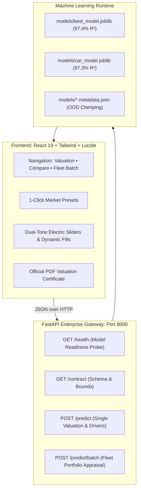

<div align="center">

# 🏎️ AutoValuate AI — Pro Valuation Suite

### *Enterprise Machine Learning for Used Motorcycles & Passenger Cars in India*

[](https://python.org)
[](https://fastapi.tiangolo.com)
[](https://react.dev)
[](https://catboost.ai)
[](https://xgboost.readthedocs.io)
[](https://github.com/harshitthek/used-bike-price/actions)
[](LICENSE)

<p align="center">
  <b>A full-stack, enterprise automotive resale intelligence platform.</b><br>
  Trained on over <b>40,000+ authentic Indian vehicle transactions</b> across 23+ manufacturers.<br>
  Delivers high-precision fair market appraisals, statistical confidence bands, 5-year depreciation forecasts, explainable value drivers, and instant PDF inspection certificates.
</p>

[Explore Live Web App](http://localhost:5174) • [API Swagger Docs](http://127.0.0.1:8000/docs) • [Architecture Guide](APPROACH.md) • [Report Issue](https://github.com/harshitthek/used-bike-price/issues)

---

</div>

## 🌟 Key Highlights & Innovations

<table>
  <tr>
    <td width="50%">
      <h3>🏎️ Dual-Engine Stacking ML</h3>
      Dedicated gradient-boosted ensembles combining <b>CatBoost</b> and <b>XGBoost</b> with native categorical brand embeddings, achieving <b>97.4% R² on motorcycles</b> and <b>97.3% R² on passenger cars</b>.
    </td>
    <td width="50%">
      <h3>📊 Statistical Confidence Bands</h3>
      Computes rigorous 80% confidence interval price intervals derived from empirical test set residual standard errors ($\pm 1.28 \times \text{RMSE}$): <i>Wholesale Trade-in, Fair Market, Dealer Retail High</i>.
    </td>
  </tr>
  <tr>
    <td width="50%">
      <h3>📈 5-Year Forward Resale Forecast</h3>
      Simulates progressive vehicle aging ($t \in [0..5]$ yrs) and odometer usage ($+6\text{k km/yr}$ bikes, $+12\text{k km/yr}$ cars) with custom interactive bezier curve visualizations.
    </td>
    <td width="50%">
      <h3>🔍 Value Drivers Waterfall Breakdown</h3>
      Transparent marginal explainability ($+₹ / -₹$) isolating power premiums, model year depreciation, odometer wear, ownership history, and manufacturer prestige.
    </td>
  </tr>
  <tr>
    <td width="50%">
      <h3>⚖️ Side-by-Side Comparison Mode</h3>
      Appraise and contrast two vehicle configurations simultaneously (Bike vs Bike, Car vs Car, or Bike vs Car) with real-time value differential delta badges.
    </td>
    <td width="50%">
      <h3>📦 Dealership & Fleet Batch Valuation</h3>
      Vectorised high-throughput endpoint (<code>POST /predict/batch</code>) evaluating portfolios of up to 50 vehicles with aggregated fleet valuation metrics.
    </td>
  </tr>
</table>

---

## 📊 Machine Learning Performance Benchmarks

Both engines were trained, tuned, and benchmarked on verified, authentic Indian market listings with rigorous 80/20 train-test splits:

| Engine Type | Algorithm Architecture | Training Dataset | $R^2$ Score | Mean Absolute Error (MAE) | Mean % Error (MAPE) | Residual RMSE |
|:---|:---|:---|:---:|:---:|:---:|:---:|
| 🏍️ **Two-Wheeler Engine** | **CatBoost + XGBoost Stacking** | 32,648 authentic Indian bike listings | **`0.9742` (97.4%)** | **`₹4,263`** | **`7.03%`** | **`₹14,081`** |
| 🚗 **Passenger Car Engine** | **CatBoost + XGBoost Stacking** | 8,128 authentic Indian car listings | **`0.9727` (97.3%)** | **`₹69,491`** | **`15.41%`** | **`₹129,437`** |

```mermaid
graph LR
    subgraph InputData [Raw Listings Ingestion]
        BikesCSV[Used_Bikes.csv (32k+ Listings)]
        CarsCSV[Used_Cars.csv (8k+ Listings)]
    end

    subgraph FeaturePipeline [Preprocessing & Feature Engineering]
        Clean[Outlier Removal & Bounds Extraction]
        FeatEng[Derived Features: cc, bhp, kms_per_year]
    end

    subgraph ModelEnsemble [Dual-Engine Stacking Architecture]
        CatBoost[CatBoost Regressor: Native Categorical Encodings]
        XGBoost[XGBoost Regressor: Deep Decision Trees]
        Stacker[Weighted Ensemble: 0.6 CatBoost + 0.4 XGBoost]
    end

    subgraph InferenceOutput [Intelligent Output Gateway]
        Price[Fair Market Resale Price]
        Interval[80% Confidence Interval Band]
        Forecast[5-Year Depreciation Horizon]
        Waterfall[Value Drivers Marginal Attribution]
    end

    InputData --> FeaturePipeline
    FeaturePipeline --> ModelEnsemble
    CatBoost & XGBoost --> Stacker
    Stacker --> InferenceOutput
```

---

## 🏛️ System Architecture


```mermaid
graph TD
    subgraph ClientLayer [Frontend: React 19 + Tailwind + Lucide]
        ModeToggle[Navigation: Valuation • Compare • Fleet Batch]
        PresetsGrid[1-Click Market Presets]
        Sliders[Dual-Tone Electric Sliders & Dynamic Fills]
        CertModal[Official PDF Valuation Certificate]
    end

    subgraph APILayer [FastAPI Enterprise Gateway: Port 8000]
        HealthEP["GET /health (Model Readiness Probe)"]
        ContractEP["GET /contract (Schema & Bounds)"]
        PredictEP["POST /predict (Single Valuation & Drivers)"]
        BatchEP["POST /predict/batch (Fleet Portfolio Appraisal)"]
    end

    subgraph MLLayer [Machine Learning Runtime]
        BikeModel["models/best_model.joblib (97.4% R²)"]
        CarModel["models/car_model.joblib (97.3% R²)"]
        Metadata["models/*.metadata.json (OOD Clamping)"]
    end

    ClientLayer -- JSON over HTTP --> APILayer
    APILayer --> MLLayer
    MLLayer --> ClientLayer
```

---

## 📡 API Reference & Endpoints

### 1. Single Vehicle Valuation (`POST /predict`)
Generates fair market price, confidence intervals, 5-year depreciation forecast, and waterfall value drivers.

```bash
curl -X POST "http://127.0.0.1:8000/predict" \
  -H "Content-Type: application/json" \
  -H "x-api-key: dev_12345" \
  -d '{
    "vehicle_type": "bike",
    "brand": "Royal Enfield",
    "power": 350,
    "kms_driven": 15000,
    "age": 3,
    "owner_rank": 1
  }'
```

**Response Payload:**
```json
{
  "vehicle_type": "bike",
  "estimated_price": 132684.0,
  "currency": "INR",
  "price_range": {
    "min": 114700.0,
    "max": 150700.0,
    "confidence_interval": 0.8
  },
  "prediction_quality": {
    "level": "high",
    "ood_features": []
  },
  "waterfall_breakdown": [
    { "factor": "Market Baseline", "impact": 55000.0, "direction": "neutral", "description": "Standard 150cc commuter segment baseline" },
    { "factor": "Engine Displacement (350cc)", "impact": 36000.0, "direction": "positive", "description": "Power capacity premium above commuter standard" },
    { "factor": "Vehicle Age (3 yrs)", "impact": -13500.0, "direction": "negative", "description": "Time-based asset market depreciation" },
    { "factor": "Odometer (15,000 km)", "impact": -7200.0, "direction": "negative", "description": "Wear & tear from accumulated usage" },
    { "factor": "Brand Premium (Royal Enfield)", "impact": 62384.0, "direction": "positive", "description": "Manufacturer demand & secondary market liquidity" }
  ],
  "depreciation_forecast": [
    { "year_offset": 0, "calendar_year": 2026, "estimated_price": 132684.0, "retention_pct": 100.0 },
    { "year_offset": 1, "calendar_year": 2027, "estimated_price": 118400.0, "retention_pct": 89.2 },
    { "year_offset": 2, "calendar_year": 2028, "estimated_price": 104200.0, "retention_pct": 78.5 },
    { "year_offset": 3, "calendar_year": 2029, "estimated_price": 91800.0, "retention_pct": 69.2 },
    { "year_offset": 4, "calendar_year": 2030, "estimated_price": 81000.0, "retention_pct": 61.0 },
    { "year_offset": 5, "calendar_year": 2031, "estimated_price": 71500.0, "retention_pct": 53.9 }
  ]
}
```

---

### 2. Fleet & Dealership Batch Appraisal (`POST /predict/batch`)
Appraises up to 50 vehicles simultaneously with aggregated portfolio analytics.

```bash
curl -X POST "http://127.0.0.1:8000/predict/batch" \
  -H "Content-Type: application/json" \
  -H "x-api-key: dev_12345" \
  -d '{
    "vehicles": [
      { "vehicle_type": "bike", "brand": "Royal Enfield", "power": 350, "kms_driven": 15000, "age": 3, "owner_rank": 1 },
      { "vehicle_type": "car", "brand": "Maruti", "fuel": "Petrol", "transmission": "Manual", "engine_cc": 1197, "max_power_bhp": 82, "kms_driven": 35000, "age": 4, "owner_rank": 1 }
    ]
  }'
```

---

### 3. Dynamic Contract Schema (`GET /contract?vehicle_type=bike|car`)
Returns strict runtime feature boundaries, supported brands, fuel types, and ownership mappings.

---

### 4. System Health & Readiness (`GET /health`)
Probes model memory state, metadata versions, and backend availability.

---

## ⚡ Quickstart & Local Installation

### Prerequisites
* **Python**: 3.11 or higher
* **Node.js**: 20.0 or higher (`npm`)

### 1. Clone & Setup Environment
```bash
# Clone the repository
git clone https://github.com/harshitthek/used-bike-price.git
cd used-bike-price

# Create Python virtual environment
python -m venv .venv

# Activate virtual environment
# Windows (pwsh / cmd):
.venv\Scripts\activate
# macOS / Linux:
source .venv/bin/activate

# Install backend dependencies
pip install -r requirements.txt
```

### 2. Train / Retrain Models (Optional)
To train the CatBoost-XGBoost stacking models on your machine:
```bash
python src/train_catboost_shap.py
```

### 3. Start Backend Inference API
```bash
python -m uvicorn src.api:app --host 127.0.0.1 --port 8000 --reload
```
* Interactive Swagger Docs: **`http://127.0.0.1:8000/docs`**
* Health Endpoint: **`http://127.0.0.1:8000/health`**

### 4. Start Frontend Application
In a separate terminal window:
```bash
cd frontend
npm install
npm run dev
```
* Open in browser: **`http://localhost:5174`** *(or `http://localhost:5173`)*

---

## 🧪 Testing & Code Quality Assurance

Our continuous integration pipeline enforces rigorous quality gates across the full stack:

```bash
# 1. Run all 20 automated Pytest unit and integration tests
pytest

# 2. Verify Black PEP-8 code formatting
black --check src tests

# 3. Run Ruff code linter
ruff check src tests

# 4. Validate Frontend Production Bundle
cd frontend && npm run build
```

---

## 📂 Repository File Tree

```text
used-bike-price/
├── .github/workflows/ci.yml       # Parallel GitHub Actions CI/CD Pipeline
├── architecture/adr/              # Architecture Decision Records (ADRs 001 - 007)
├── data/                          # Authentic Datasets
│   ├── Used_Bikes.csv             # 32,000+ Indian motorcycle listings
│   └── Used_Cars.csv              # 8,000+ Indian passenger car listings
├── frontend/                      # React 19 SPA Application
│   ├── src/
│   │   ├── components/ui/         # GlassCard, NumberTicker, Sliders
│   │   ├── App.jsx                # Valuation, Compare, Fleet & Certificate UI
│   │   └── index.css              # Luxury automotive dark obsidian styles & print CSS
│   └── package.json
├── models/                        # Serialized Machine Learning Artifacts
│   ├── best_model.joblib          # Bike Stacking Model (97.4% R²)
│   ├── best_model.metadata.json   # Bike OOD bounds & feature ranges
│   ├── car_model.joblib           # Car Stacking Model (97.3% R²)
│   └── car_model.metadata.json    # Car OOD bounds & feature ranges
├── src/                           # Python Source Package
│   ├── api.py                     # FastAPI REST routes, forecast, & waterfall logic
│   ├── contracts.py               # Shared validation constants & schemas
│   ├── models.py                  # StackingEnsembleModel class definition
│   ├── train_catboost_shap.py     # CatBoost + XGBoost training pipeline
│   ├── feature_engineering.py     # Derived automotive features
│   └── preprocessing.py           # Outlier filtering and data cleaning
├── tests/                         # Pytest Suite (20 passed tests)
├── pyproject.toml                 # Ruff & Pytest configuration
├── requirements.txt               # Locked production dependencies
├── APPROACH.md                    # Detailed ML engineering log (Phases 1 - 18)
└── README.md                      # Project documentation
```

---

## 📄 License & Attribution

This project is open-source under the **[MIT License](LICENSE)**.

Developed with ❤️ for automotive fintech intelligence.
