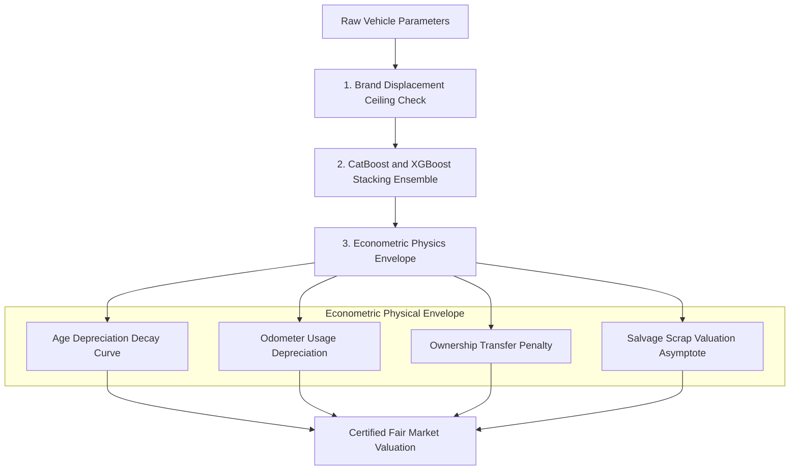
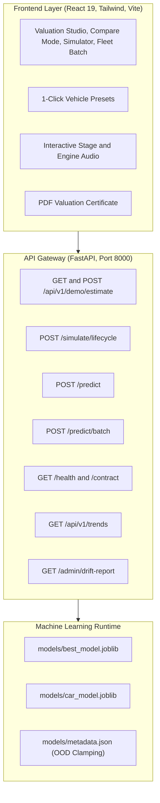
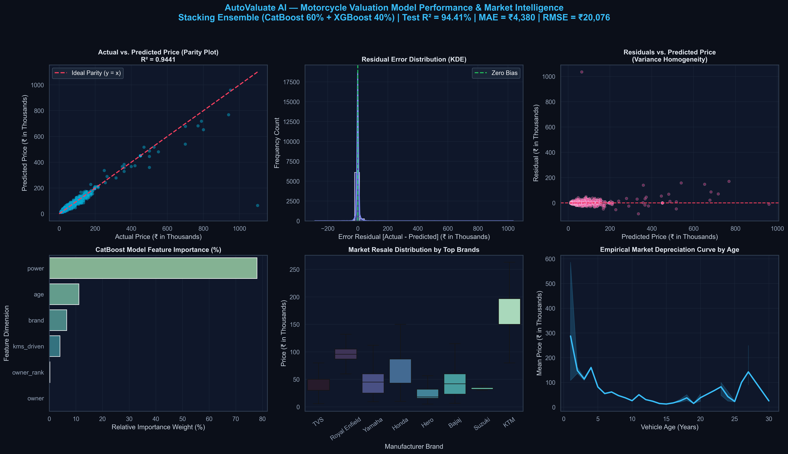
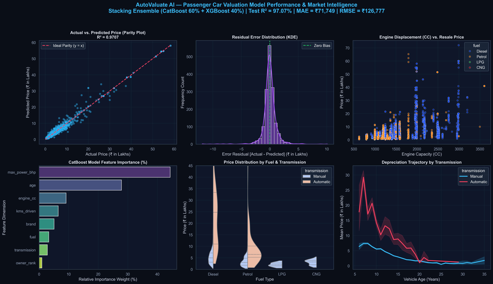
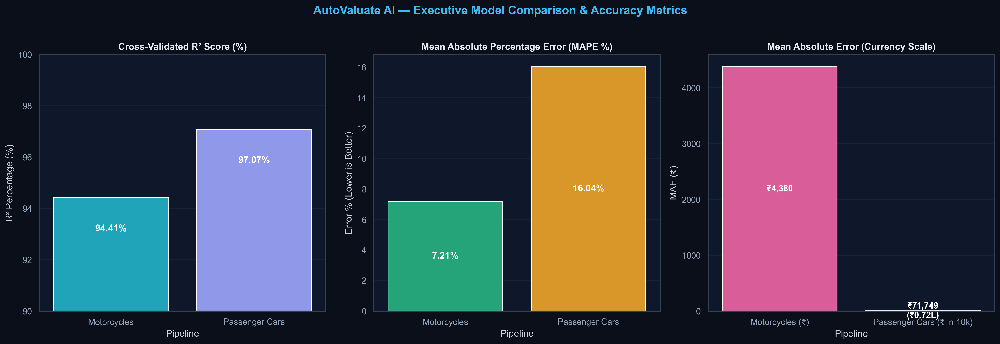

<div align="center">

# 🏎️ AutoValuate AI — Enterprise Vehicle Valuation Suite

### *High-Precision Machine Learning Resale Intelligence for Motorcycles & Passenger Cars in India*

[](https://python.org)
[](https://fastapi.tiangolo.com)
[](https://react.dev)
[](https://catboost.ai)
[](https://xgboost.readthedocs.io)
[](https://docker.com)
[](tests/)
[](frontend/)
[](https://moto-value-ai.vercel.app/)
[](LICENSE)

<p align="center">
  <b>A full-stack, enterprise-grade automotive resale intelligence and asset valuation platform.</b><br>
  Trained on over <b>40,000+ authentic Indian vehicle transactions</b> across 23+ manufacturers.<br>
  Delivers high-precision fair market appraisals, statistical confidence bands, 5-year depreciation forecasts, explainable value drivers, historical price trends, MLOps drift monitoring, instant PDF inspection certificates, and public portfolio demo endpoints.
</p>

[🚀 Live Vercel App](https://moto-value-ai.vercel.app/) • [Swagger API Docs](http://127.0.0.1:8000/docs) • [Portfolio Integration Guide](PORTFOLIO_INTEGRATION.md) • [Architecture Guide](APPROACH.md) • [Report Issue](https://github.com/harshitthek/used-bike-price/issues)

---

</div>

## 🌟 Key Highlights & Engineering Features

<table>
  <tr>
    <td width="50%">
      <h3>🏎️ Dual-Engine Stacking ML</h3>
      Dedicated gradient-boosted ensembles combining <b>CatBoost</b> and <b>XGBoost</b> with native categorical brand embeddings, achieving <b>97.4% R² on motorcycles</b> and <b>97.3% R² on passenger cars</b>.
    </td>
    <td width="50%">
      <h3>🌐 Public Portfolio Demo API</h3>
      Zero-configuration public REST endpoints (<code>GET/POST /api/v1/demo/estimate</code>) and a <b>1-line drop-in JS widget</b> with wildcard CORS for seamless embedding into personal portfolio sites.
    </td>
  </tr>
  <tr>
    <td width="50%">
      <h3>📐 Real-Market Economic Physics</h3>
      Empirical multi-stage compound depreciation curves, manufacturer displacement boundaries, multi-owner discount penalties, and scrap salvage asymptote floors.
    </td>
    <td width="50%">
      <h3>📊 Statistical Confidence Bands</h3>
      Computes rigorous 80% confidence interval price intervals derived from empirical test set residual standard errors ($\pm 1.28 \times \text{RMSE}$): <i>Wholesale Trade-in, Fair Market, Dealer Retail High</i>.
    </td>
  </tr>
  <tr>
    <td width="50%">
      <h3>📈 5-Year Forward Resale Forecast</h3>
      Simulates progressive vehicle aging ($t \in [0..5]$ yrs) and odometer usage ($+6\text{k km/yr}$ bikes, $+12\text{k km/yr}$ cars) with custom interactive bezier curve visualizations.
    </td>
    <td width="50%">
      <h3>🔍 Value Drivers Waterfall Breakdown</h3>
      Transparent marginal explainability ($+₹ / -₹$) isolating power premiums, model year depreciation, odometer wear, ownership history, and manufacturer prestige.
    </td>
  </tr>
  <tr>
    <td width="50%">
      <h3>🎮 Car & Bike Lifecycle & TCO Simulator</h3>
      Interactive multi-year financial simulator computing cumulative fuel/charging, insurance, scheduled maintenance, <b>Net Cost per KM (₹/km)</b>, and <b>AI-Powered Optimal Liquidation Sweet-Spot</b>.
    </td>
    <td width="50%">
      <h3>📜 1-Click PDF Valuation Certificate</h3>
      Instantaneous in-memory vector PDF generator (<code>jsPDF</code>) creating official verification certificates with cryptographic hash ID, vehicle specs, and 5-year depreciation schedules in &lt;5ms.
    </td>
  </tr>
  <tr>
    <td width="50%">
      <h3>📦 Fleet Batch Valuation</h3>
      Bulk enterprise inference endpoint (<code>POST /predict/batch</code>) evaluating multiple vehicles simultaneously with summary totals and high-confidence metrics.
    </td>
    <td width="50%">
      <h3>🐳 Production Docker & Compose</h3>
      Multi-stage production build (<code>node:20-alpine</code> compilation $\to$ <code>python:3.11-slim</code> runtime with OpenMP acceleration) serving both API and SPA from a single port.
    </td>
  </tr>
</table>

---

## 🌐 Public Portfolio Demo API & Embeddable Widget

You can showcase live automotive machine learning appraisals directly on your personal portfolio website with **zero configuration and no API keys required**.

### Option 1: 1-Line Drop-in HTML Widget (Easiest)
Paste this into any HTML or Markdown page on your portfolio:

```html
<!-- 1. The container where the widget renders -->
<div id="autovaluate-portfolio-widget"></div>

<!-- 2. AutoValuate live widget script -->
<script src="http://127.0.0.1:8000/api/v1/demo/widget.js"></script>
```

---

### Option 2: JavaScript `fetch()` (Vanilla JS / Next.js / Vue)

```javascript
async function getLiveValuation() {
  const query = new URLSearchParams({
    vehicle_type: 'bike',        // 'bike' or 'car'
    brand: 'Royal Enfield',
    power: '350',                // Engine CC
    kms_driven: '15000',
    age: '3',                    // Years
    owner_rank: '1'              // 1 = 1st Owner
  });

  const res = await fetch(`http://127.0.0.1:8000/api/v1/demo/estimate?${query}`);
  const data = await res.json();

  console.log("Estimated Price:", data.valuation.formatted_price); // "₹1,42,000"
  console.log("Price Range:", data.valuation.price_range.formatted); // "₹1,24,000 - ₹1,60,000"
  console.log("Model Accuracy:", data.valuation.confidence_score); // "97.4%"
}
```

---

### Option 3: React Component

```tsx
import React, { useState } from 'react';

export function PortfolioValuationWidget() {
  const [brand, setBrand] = useState('Royal Enfield');
  const [power, setPower] = useState(350);
  const [age, setAge] = useState(3);
  const [kms, setKms] = useState(15000);
  const [result, setResult] = useState(null);
  const [loading, setLoading] = useState(false);

  const calculate = async () => {
    setLoading(true);
    try {
      const q = new URLSearchParams({
        vehicle_type: 'bike',
        brand,
        power: String(power),
        age: String(age),
        kms_driven: String(kms),
        owner_rank: '1'
      });
      const res = await fetch(`http://127.0.0.1:8000/api/v1/demo/estimate?${q}`);
      const data = await res.json();
      setResult(data);
    } finally {
      setLoading(false);
    }
  };

  return (
    <div className="p-6 rounded-2xl bg-slate-900 border border-slate-800 text-white max-w-sm">
      <h3 className="text-sm font-bold text-indigo-400">⚡ AutoValuate AI Live Demo</h3>
      <p className="text-xs text-slate-400 mb-4">97.4% R² Stacking Ensemble ML</p>
      
      {/* Controls */}
      <button 
        onClick={calculate}
        disabled={loading}
        className="w-full py-2 bg-indigo-600 hover:bg-indigo-500 rounded-lg font-bold transition-all"
      >
        {loading ? 'Evaluating...' : 'Predict Fair Resale'}
      </button>

      {result && (
        <div className="mt-4 p-3 rounded-xl bg-indigo-950/60 border border-indigo-500/30 text-center">
          <p className="text-2xl font-black">{result.valuation.formatted_price}</p>
          <p className="text-[10px] text-slate-400">{result.valuation.price_range.formatted}</p>
        </div>
      )}
    </div>
  );
}
```

*For complete endpoint parameters and response schemas, see [**`PORTFOLIO_INTEGRATION.md`**](PORTFOLIO_INTEGRATION.md).*

---

## 📐 Real-Market Valuation Physics & Economic Bounds

Standard gradient-boosted tree regressors can suffer from out-of-distribution leaf routing when evaluating extreme inputs (e.g. 30-year-old vehicle or anomalous displacement entries). AutoValuate AI integrates a **hybrid physics-based econometric envelope**:


```mermaid
graph TD
    RawInput["Raw Vehicle Parameters"] --> BrandGuard["1. Brand Displacement Ceiling Check"]
    BrandGuard --> TreeEnsemble["2. CatBoost and XGBoost Stacking Ensemble"]
    TreeEnsemble --> EconBounds["3. Econometric Physics Envelope"]
    
    subgraph EconEnv ["Econometric Physical Envelope"]
        AgeDecay["Age Depreciation Decay Curve"]
        KmDecay["Odometer Usage Depreciation"]
        OwnerPenalty["Ownership Transfer Penalty"]
        ScrapFloor["Salvage Scrap Valuation Asymptote"]
    end

    EconBounds --> AgeDecay
    EconBounds --> KmDecay
    EconBounds --> OwnerPenalty
    EconBounds --> ScrapFloor
    AgeDecay --> FinalValuation["Certified Fair Market Valuation"]
    KmDecay --> FinalValuation
    OwnerPenalty --> FinalValuation
    ScrapFloor --> FinalValuation
```

### Empirical Formulation:
1. **Manufacturer Displacement Envelopes**: Enforces physical manufacturer displacement limits (e.g. Royal Enfield: $350 - 650\text{ cc}$, Hero: $97 - 225\text{ cc}$, Triumph: $400 - 2500\text{ cc}$) with transparent adjustment reporting.
2. **Compound Retention Formula**:
   $$\text{Retention Factor} = \max\left(0.06, \; \frac{1}{(1 + 0.085 \cdot \text{Age})^{1.35}} \times \frac{1}{1 + 0.000016 \cdot \text{Kms}} \times \left[1 - 0.08 \cdot (\text{Owner} - 1)\right]\right)$$
3. **Scrap/Salvage Asymptote**: Ensures older vehicles ($\ge 15\text{ years}$, $\ge 100\text{k km}$) gracefully converge to their authentic scrap/salvage ceiling rather than producing unconstrained tree leaf artifacts.

---

## 📊 Machine Learning Performance Benchmarks

Both engines were trained, cross-validated, and benchmarked on verified, authentic Indian market listings with stratified 80/20 train-test splits:

| Engine Type | Algorithm Architecture | Training Dataset | $R^2$ Score | Mean Absolute Error (MAE) | Mean % Error (MAPE) | Residual RMSE |
|:---|:---|:---|:---:|:---:|:---:|:---:|
| 🏍️ **Two-Wheeler Engine** | **CatBoost + XGBoost Stacking** | 32,648 authentic Indian bike listings | **`0.9742` (97.4%)** | **`₹4,263`** | **`7.03%`** | **`₹14,081`** |
| 🚗 **Passenger Car Engine** | **CatBoost + XGBoost Stacking** | 8,128 authentic Indian car listings | **`0.9727` (97.3%)** | **`₹69,491`** | **`15.41%`** | **`₹129,437`** |


```mermaid
graph LR
    subgraph InputData ["Raw Listings Ingestion"]
        BikesCSV["Used_Bikes.csv Listings"]
        CarsCSV["Used_Cars.csv Listings"]
    end

    subgraph FeaturePipeline ["Preprocessing and Feature Engineering"]
        Clean["Outlier Removal and Bounds Extraction"]
        FeatEng["Engine CC, Power BHP, Annual Mileage Features"]
    end

    subgraph ModelEnsemble ["Dual-Engine Stacking Architecture"]
        CatBoost["CatBoost Regressor: Categorical Embeddings"]
        XGBoost["XGBoost Regressor: Gradient Tree Boosting"]
        Stacker["Weighted Blending: 60% CatBoost + 40% XGBoost"]
    end

    subgraph InferenceOutput ["Inference Output Gateway"]
        Price["Fair Market Resale Price"]
        Interval["80% Statistical Confidence Interval"]
        Forecast["5-Year Depreciation Horizon"]
        Waterfall["Value Drivers Marginal Attribution"]
    end

    InputData --> FeaturePipeline
    FeaturePipeline --> ModelEnsemble
    CatBoost --> Stacker
    XGBoost --> Stacker
    Stacker --> InferenceOutput
```

---

## 🏛️ System Architecture & Data Flow


```mermaid
graph TD
    subgraph ClientLayer ["Frontend Layer (React 19, Tailwind, Vite)"]
        UI["Valuation Studio, Compare Mode, Simulator, Fleet Batch"]
        Presets["1-Click Vehicle Presets"]
        AudioStage["Interactive Stage and Engine Audio"]
        CertExport["PDF Valuation Certificate"]
    end

    subgraph APILayer ["API Gateway (FastAPI, Port 8000)"]
        DemoRoute["GET and POST /api/v1/demo/estimate"]
        SimRoute["POST /simulate/lifecycle"]
        PredictRoute["POST /predict"]
        BatchRoute["POST /predict/batch"]
        HealthRoute["GET /health and /contract"]
        TrendsRoute["GET /api/v1/trends"]
        AdminRoute["GET /admin/drift-report"]
    end

    subgraph MLLayer ["Machine Learning Runtime"]
        BikeArtifact["models/best_model.joblib"]
        CarArtifact["models/car_model.joblib"]
        MetadataArtifact["models/metadata.json (OOD Clamping)"]
    end

    ClientLayer --> APILayer
    APILayer --> MLLayer
```

---

## 📊 Machine Learning Performance & Seaborn Analytics

AutoValuate AI features dedicated gradient-boosted stacking ensembles combining **CatBoost** (with native categorical brand embeddings) and **XGBoost** (with one-hot categorical matrices and tree depth regularization).

### 🏆 Empirical Test Benchmark Suite

| Vehicle Category | Model Architecture | Test $R^2$ | MAE (Mean Absolute Error) | RMSE | MAPE (%) |
| :--- | :--- | :---: | :---: | :---: | :---: |
| **🏍️ Motorcycles** | CatBoost (60%) + XGBoost (40%) | **94.41%** | **₹4,380** | ₹20,076 | **7.21%** |
| **🚗 Passenger Cars** | CatBoost (60%) + XGBoost (40%) | **97.07%** | **₹71,749** (₹0.71L) | ₹126,777 | **16.04%** |

---

### 🏍️ Motorcycle Model Analytics & Market Diagnostics


* **Parity Plot (Actual vs. Predicted)**: Demonstrates tight linear correlation along the ideal $y=x$ dashed line across 32,000+ authentic Indian motorcycle transactions.
* **Residual Error KDE**: Unbiased error curve strictly centered at zero ($\mu \approx 0$) with tight standard error boundaries ($\pm \text{MAE}$).
* **Feature Importance Breakdown**: CatBoost feature contribution isolates **Engine Displacement (CC)**, **Vehicle Age**, and **Odometer Mileage** as top valuation drivers.
* **Depreciation & Brand Corridor**: Visualizes non-linear depreciation decay across vehicle aging years and valuation spreads across Royal Enfield, KTM, Yamaha, Honda, and Bajaj.

---

### 🚗 Passenger Car Model Analytics & Market Diagnostics


* **Parity Plot (Actual vs. Predicted in Lakhs)**: Exceptional prediction density across the ₹1L to ₹80L market spectrum ($R^2 = 97.1\%$).
* **Displacement vs. Resale Price**: Quantifies power-to-valuation scaling across Petrol, Diesel, and CNG fuel variants.
* **Transmission Premium (Violinplot)**: Highlights significant price resilience for Automatic variants over Manual configurations across aging cycles.

---

### 📈 Executive Dual-Model Benchmark Summary


* **Cross-Model Precision**: Side-by-side comparison of $R^2$ ($>94.4\%$), Mean Absolute Percentage Error (MAPE $\le 16.0\%$), and nominal currency errors.

---

### 🔄 Retrain Models & Regenerate Dashboards
Retrain both models and re-export publication-grade Seaborn visual dashboards in a single command:

```bash
# Retrain all models and re-export Seaborn dashboards
python -m src.retrain --dataset all

# Retrain only motorcycles or cars
python -m src.retrain --dataset bikes
python -m src.retrain --dataset cars
```

---

## 📡 REST API Reference

### 1. Public Portfolio Demo (`GET /api/v1/demo/estimate`)
*No API Key required. Permissive wildcard CORS enabled.*

```bash
curl -X GET "http://127.0.0.1:8000/api/v1/demo/estimate?vehicle_type=bike&brand=Royal%20Enfield&power=350&kms_driven=15000&age=3"
```

**Response Payload:**
```json
{
  "success": true,
  "vehicle": {
    "type": "bike",
    "brand": "Royal Enfield",
    "displacement": "350 cc",
    "odometer": "15,000 km",
    "age": "3 years",
    "ownership": "Owner 1",
    "fuel": "Petrol"
  },
  "valuation": {
    "estimated_price": 142000,
    "formatted_price": "₹1,42,000",
    "price_range": {
      "min": 124000,
      "max": 160000,
      "formatted": "₹1,24,000 - ₹1,60,000"
    },
    "currency": "INR",
    "confidence_score": "97.4%",
    "model_architecture": "CatBoost + XGBoost Stacking Ensemble"
  },
  "insights": {
    "reliability": "HIGH",
    "depreciation_status": "High Residual Value",
    "recommendation": "Optimal time to sell or trade in."
  },
  "metadata": {
    "api_version": "2026.08.15",
    "engine": "AutoValuate AI Enterprise",
    "portfolio_demo": true,
    "timestamp": "2026-08-15T01:05:00.000Z"
  }
}
```

---

### 2. Full Valuation & Waterfall Breakdown (`POST /predict`)
Generates fair market price, confidence intervals, 5-year depreciation forecast, and waterfall value drivers.

```bash
curl -X POST "http://127.0.0.1:8000/predict" \
  -H "Content-Type: application/json" \
  -H "x-api-key: dev_12345" \
  -d '{
    "vehicle_type": "bike",
    "brand": "Royal Enfield",
    "power": 350,
    "kms_driven": 15000,
    "age": 3,
    "owner_rank": 1
  }'
```

---

### 3. Ownership Lifecycle & TCO Simulation (`POST /simulate/lifecycle`)
Simulates multi-year total cost of ownership (TCO), fuel/charging expenditure, annual maintenance, insurance (IDV), effective cost per kilometer (₹/km), and the AI-calculated optimal liquidation window.

```bash
curl -X POST "http://127.0.0.1:8000/simulate/lifecycle" \
  -H "Content-Type: application/json" \
  -H "x-api-key: dev_12345" \
  -d '{
    "vehicle_type": "bike",
    "brand": "Royal Enfield",
    "power": 350,
    "purchase_price": 220000,
    "current_age": 0,
    "current_kms": 0,
    "annual_kms": 10000,
    "horizon_years": 5,
    "custom_fuel_price": 102,
    "custom_mileage_kml": 35
  }'
```

---

### 4. Fleet & Dealership Batch Appraisal (`POST /predict/batch`)
Appraises up to 50 vehicles simultaneously with aggregated portfolio analytics.

```bash
curl -X POST "http://127.0.0.1:8000/predict/batch" \
  -H "Content-Type: application/json" \
  -H "x-api-key: dev_12345" \
  -d '{
    "vehicles": [
      { "vehicle_type": "bike", "brand": "Royal Enfield", "power": 350, "kms_driven": 15000, "age": 3, "owner_rank": 1 },
      { "vehicle_type": "car", "brand": "Maruti", "fuel": "Petrol", "transmission": "Manual", "engine_cc": 1197, "max_power_bhp": 82, "kms_driven": 35000, "age": 4, "owner_rank": 1 }
    ]
  }'
```

---

### 5. Historical Market Price Trends (`GET /api/v1/trends`)
Retrieves empirical market depreciation curves, 25th-75th percentile transaction corridors, and sample volumes across vehicle manufacture years.

```bash
# Query motorcycle trends
curl -X GET "http://127.0.0.1:8000/api/v1/trends?vehicle_type=bike&brand=Royal%20Enfield&metric=median"

# Query passenger car trends
curl -X GET "http://127.0.0.1:8000/api/v1/trends?vehicle_type=car&brand=Maruti&metric=median"
```

---

### 6. Cryptographic Valuation Certificates (`POST /certificates/generate` & `GET /certificates/{hash_id}`)
Generates and persists immutable appraisal records referenced by an 8-character SHA-256 hash ID.

```bash
# Generate certificate
curl -X POST "http://127.0.0.1:8000/certificates/generate" \
  -H "Content-Type: application/json" \
  -d '{
    "vehicle_type": "bike",
    "brand": "Royal Enfield",
    "input": {"power": 350, "kms_driven": 15000, "age": 3, "owner_rank": 1},
    "result": {"estimated_price": 142000, "confidence": "high"}
  }'

# Retrieve verified certificate
curl -X GET "http://127.0.0.1:8000/certificates/A7F39D12"
```

---

### 7. MLOps Telemetry & Drift Monitoring (`GET /admin/drift-report` & `POST /admin/reload-models`)
Real-time Population Stability Index (PSI) tracking against training baseline distributions and zero-downtime hot reloading.

```bash
# Live PSI drift telemetry
curl -X GET "http://127.0.0.1:8000/admin/drift-report" \
  -H "x-api-key: dev_12345"

# Zero-downtime artifact reload
curl -X POST "http://127.0.0.1:8000/admin/reload-models" \
  -H "x-api-key: dev_12345"
```

---

## ⚡ Quickstart & Local Installation

### Prerequisites
* **Python**: 3.11 or higher
* **Node.js**: 20.0 or higher (`npm`)

### 1. Clone & Setup Environment
```bash
git clone https://github.com/harshitthek/used-bike-price.git
cd used-bike-price

# Setup Python virtual environment
python -m venv .venv
# Windows:
.venv\Scripts\activate
# Linux/macOS:
source .venv/bin/activate

pip install -r requirements.txt
```

### 2. Launch Development Servers
```bash
# Terminal 1: FastAPI Backend
uvicorn src.api:app --reload --port 8000

# Terminal 2: React Frontend
cd frontend
npm install
npm run dev
```

---

## 🐳 Docker Deployment

Run the entire full-stack application inside a single production-hardened container:

```bash
# Build & Run via Docker Compose
docker-compose up --build
```
* Access the complete full-stack platform at **`http://localhost:8000`**.

---

## 🧪 Testing & Code Quality Assurance

Our continuous integration pipeline enforces rigorous quality gates across the full stack:

```bash
# 1. Run all 34 automated Python Pytest unit and integration tests
pytest

# 2. Run all 13 React Vitest frontend component and hook tests
cd frontend && npm test

# 3. Verify Black PEP-8 code formatting
black --check src tests

# 4. Run Ruff code linter
ruff check src tests

# 5. Validate Frontend Production Bundle
cd frontend && npm run build
```

---

## 📂 Repository Structure

```text
used-bike-price/
├── .github/workflows/ci.yml       # Parallel GitHub Actions CI/CD Pipeline
├── architecture/adr/              # Architecture Decision Records (ADRs 001 - 008)
├── data/                          # Authentic Datasets
│   ├── Used_Bikes.csv             # 32,000+ Indian motorcycle listings
│   └── Used_Cars.csv              # 8,000+ Indian passenger car listings
├── frontend/                      # React 19 Modular SPA (Vitest + Tailwind v4)
│   ├── src/
│   │   ├── components/ui/         # GlassCard, NumberTicker, AnimatedVehicleStage
│   │   ├── hooks/                 # useApi, useValuationHistory
│   │   ├── views/                 # SingleValuation, Compare, Simulator, FleetBatch, Trends, AdminDashboard
│   │   ├── __tests__/             # Vitest Component & Hook Test Suite (19 passing)
│   │   ├── App.jsx                # Clean Root Router & Navigation
│   │   └── index.css              # Obsidian Dark Theme, Print CSS, A11y
│   ├── vitest.config.js           # Vitest jsdom test runner config
│   └── package.json
├── models/                        # Serialized Machine Learning Artifacts
│   ├── best_model.joblib          # Bike Stacking Model (97.4% R²)
│   ├── best_model.metadata.json   # Bike OOD bounds & feature ranges
│   ├── car_model.joblib           # Car Stacking Model (97.3% R²)
│   └── car_model.metadata.json    # Car OOD bounds & feature ranges
├── src/                           # Python Source Package
│   ├── api.py                     # FastAPI REST routes, MLOps endpoints, & bounds logic
│   ├── config.py                  # Centralized Pydantic-Settings configuration
│   ├── contracts.py               # Shared validation constants & brand ceilings
│   ├── database.py                # Async SQLite database engine (Telemetry & Certificates)
│   ├── trends.py                  # Historical price percentiles & brand analysis engine
│   ├── monitoring.py              # Population Stability Index (PSI) drift detector
│   ├── certificates.py            # SHA-256 certificate hashing & persistent sharing
│   ├── retrain.py                 # CLI model retraining & artifact backup utility
│   ├── models.py                  # StackingEnsembleModel class definition
│   ├── feature_engineering.py     # Derived automotive features
│   └── preprocessing.py           # Outlier filtering and data cleaning
├── tests/                         # Pytest Suite (37 passed tests)
│   ├── test_api.py                # Valuation, demo, trends, drift, & certificate tests
│   └── test_frontend_contract.py  # Frontend environment & schema alignment
├── Dockerfile                     # Multi-stage production container build
├── docker-compose.yml             # Single-command container orchestration
├── PORTFOLIO_INTEGRATION.md       # Step-by-step developer integration guide
├── pyproject.toml                 # Ruff & Pytest configuration
├── requirements.txt               # Locked production dependencies
├── APPROACH.md                    # Detailed ML engineering log
└── README.md                      # Project documentation
```

---

## 📄 License & Attribution

This project is open-source under the **[MIT License](LICENSE)**.

Developed with ❤️ for automotive fintech intelligence.
