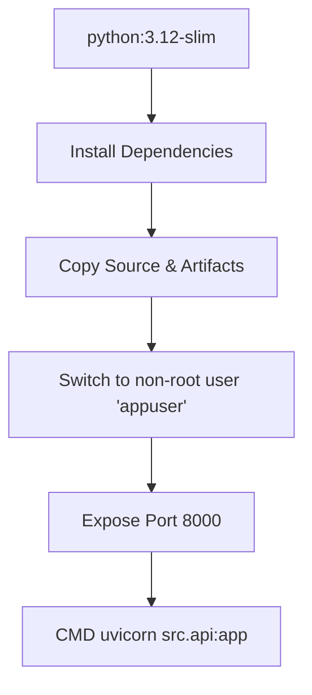

# Deployment

The deployment strategy for the Used Bike Price predictor is focused on immutability, minimal attack surface, and continuous integration.

## Containerization

The backend API is containerized using Docker.

### Security & Optimization
1. **Slim Base Image**: We use `python:3.12-slim` to reduce the image footprint and limit underlying OS vulnerabilities.
2. **Non-Root Execution**: The Dockerfile creates a dedicated `appuser`. The application runs under this unprivileged account to prevent privilege escalation attacks if the container is compromised.
3. **Internal Healthcheck**: The Dockerfile includes an internal `HEALTHCHECK` directive that curls the `/health` endpoint every 30 seconds. This allows orchestration platforms (like Docker Compose or Kubernetes) to natively monitor container health without external probing scripts.

## CI/CD Pipeline

The repository uses GitHub Actions for continuous integration.

1. **Linting and Formatting**: Enforces `ruff` (for linting) and `black` (for formatting) to ensure codebase consistency.
2. **Testing**: Runs the `pytest` suite to guarantee API contracts and health endpoints are functioning.
3. **Build Verification**: Attempts to build the Docker container to ensure the `Dockerfile` remains valid and dependencies resolve correctly.
