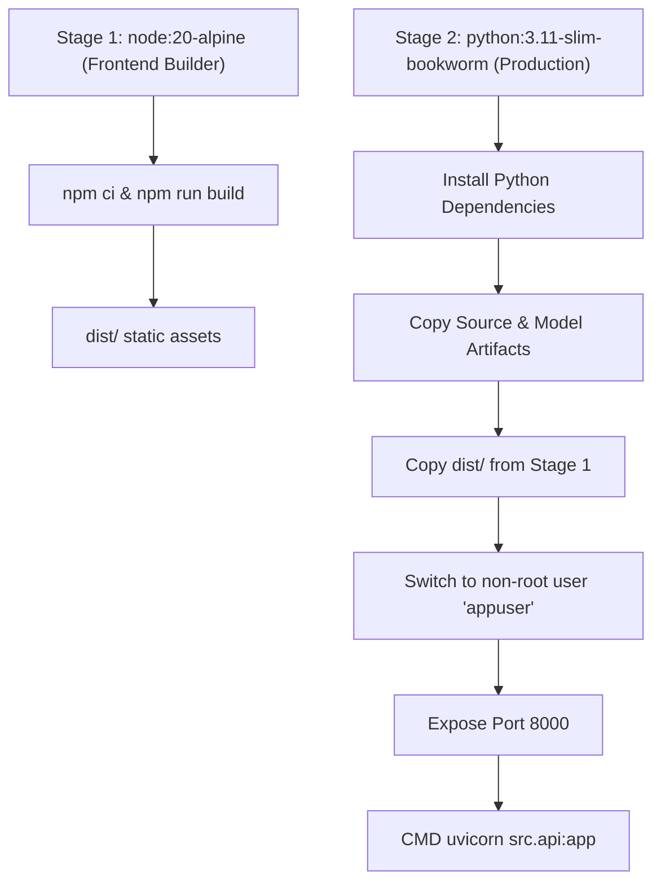

# Deployment

The deployment strategy for AutoValuate AI is focused on immutability, minimal attack surface, and continuous integration.

## Containerization

The application is containerized using a multi-stage Docker build to minimize the final image size.

```mermaid
graph TD
    Stage1["Stage 1: node:20-alpine (Frontend Builder)"] --> Build[npm ci & npm run build]
    Build --> Dist[dist/ static assets]
    
    Stage2["Stage 2: python:3.11-slim-bookworm (Production)"] --> Install[Install Python Dependencies]
    Install --> Copy[Copy Source & Model Artifacts]
    Copy --> CopyDist[Copy dist/ from Stage 1]
    CopyDist --> User[Switch to non-root user 'appuser']
    User --> Expose[Expose Port 8000]
    Expose --> Command[CMD uvicorn src.api:app]
```

### Security & Optimization
1. **Multi-Stage Build**: Stage 1 (Node 20 Alpine) compiles the React/Vite frontend; Stage 2 (Python 3.11 slim-bookworm) runs only the production API. Node.js tooling is not included in the final image.
2. **Slim Base Image**: `python:3.11-slim-bookworm` reduces the image footprint and limits underlying OS vulnerabilities.
3. **Non-Root Execution**: The Dockerfile creates a dedicated `appuser`. The application runs under this unprivileged account to prevent privilege escalation attacks.
4. **Internal Healthcheck**: The Dockerfile includes an internal `HEALTHCHECK` directive that curls the `/health` endpoint every 30 seconds, enabling orchestration platforms (Docker Compose, Kubernetes) to natively monitor container health.

## CI/CD Pipeline

The repository uses GitHub Actions (`.github/workflows/ci.yml`) for continuous integration.

1. **Linting and Formatting**: Enforces `ruff` (for linting) and `black` (for formatting) to ensure codebase consistency.
2. **Testing**: Runs the full `pytest` suite (34 tests) to verify API contracts, preprocessing, feature engineering, and frontend contract alignment.
3. **Build Verification**: Attempts to build the Docker container to ensure the `Dockerfile` remains valid and dependencies resolve correctly.
