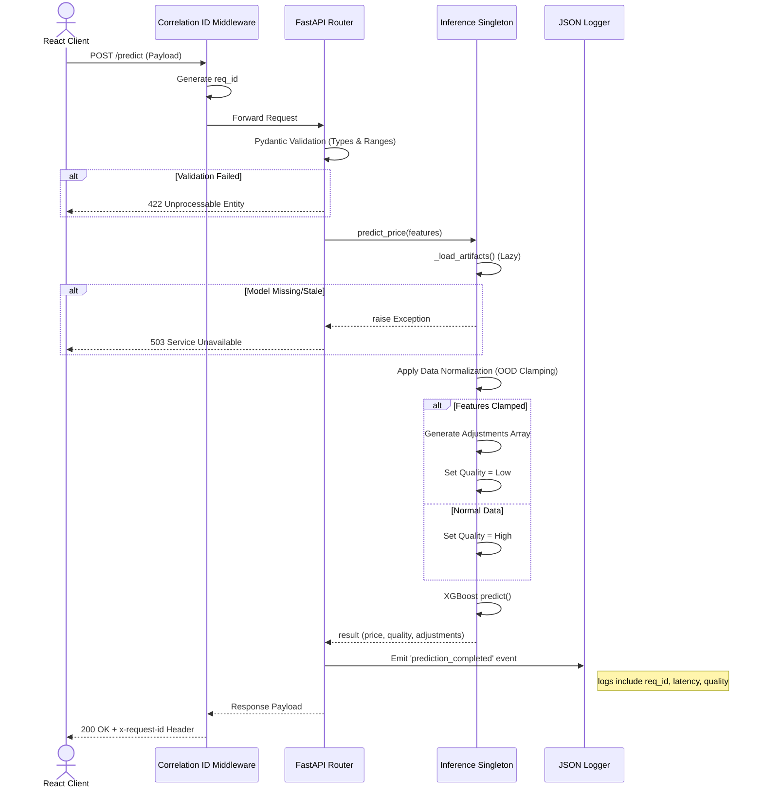

# Request Flow

The prediction inference path is designed to safely handle untrusted user inputs, log metadata for observability, and communicate confidence back to the user.

## Sequence Overview

The following sequence details what happens when a user submits a valuation request to the `POST /predict` endpoint.

## Data Normalization (Clamping)

A critical step in the sequence is **OOD Clamping**. 

Machine learning models (especially tree-based ensembles) extrapolate unpredictably when fed inputs outside their training distribution. Rather than rejecting these requests or allowing wild extrapolations, the Inference Engine:

1. Compares the input to the min/max bounds loaded from `best_model.metadata.json`.
2. Clamps the input to the bound if it exceeds it.
3. Records the clamping in an `adjustments` array.
4. Downgrades the `prediction_quality` to `low`.

This allows the UI to degrade gracefully, explaining *why* the prediction might be less reliable, rather than simply failing or presenting a nonsensical number.
