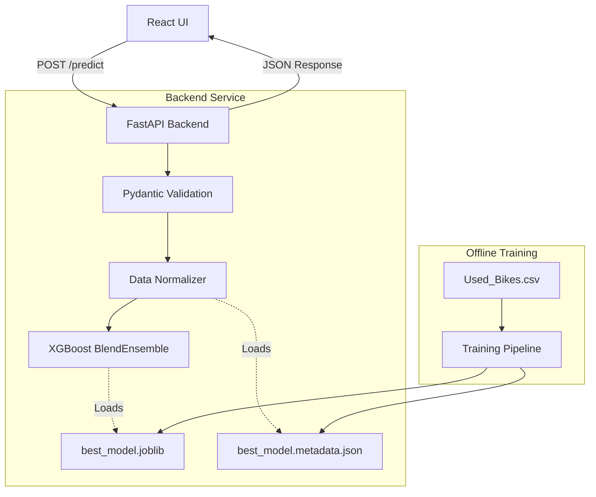

# System Overview

The Used Bike Price Prediction system is a modern, production-grade ML service designed for transparency, determinism, and operational resilience. Rather than just serving predictions, the system actively guards against Out-of-Distribution (OOD) data, emits structured operational telemetry, and provides clear explanations of its confidence levels to end users.

## High-Level Architecture

The system is conceptually divided into four layers:

1.  **Client UI (React/Vite)**: A rich, glassmorphic frontend that collects user inputs and presents both the prediction and the *context* of that prediction (confidence levels, adjustments made).
2.  **API Layer (FastAPI)**: The gateway that handles request validation, rate limiting, and structured logging.
3.  **Inference Engine**: A singleton layer that lazily loads the serialized model and its accompanying metadata, applying bounded data normalization before inference.
4.  **Training Pipeline**: An offline process that cleans raw data, engineers features, tunes hyperparameters across multiple algorithms, and produces the deterministic `.joblib` and `.metadata.json` artifacts used by the inference engine.

## Key Principles

-   **Determinism**: Model training uses strict random states to ensure that the same code and data always produce the exact same artifacts.
-   **Metadata-Driven**: The API does not hardcode feature boundaries. It dynamically reads acceptable ranges from `.metadata.json` generated at training time.
-   **Explicit Degradation**: The `/health` endpoint exposes internal state (e.g., `model_loaded: false`) rather than masking it.
-   **Explainability over Extrapolation**: When given unrealistic data, the system clamps the inputs, generates a prediction, but clearly flags the result as "Low Confidence" and details the exact adjustments applied.
