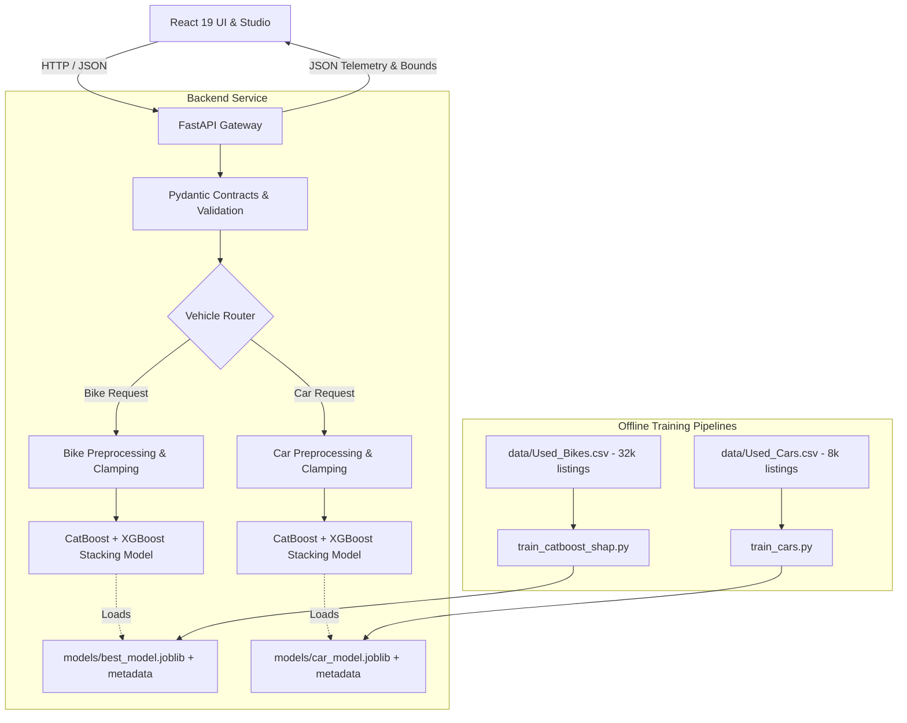

# System Overview

AutoValuate AI is a production-grade ML service designed for transparency, determinism, and operational resilience. Rather than just serving point predictions, the system actively guards against Out-of-Distribution (OOD) data, emits structured operational telemetry, calculates empirical confidence intervals ($\pm 1.28 \times \text{RMSE}$), projects 5-year depreciation schedules, and runs real-time vehicle lifecycle and Total Cost of Ownership (TCO) simulations.

## High-Level Architecture

The system is conceptually divided into four layers:

1.  **Client UI (React 19 / Tailwind v4 / Vite)**: A responsive, glassmorphic frontend supporting Single Valuation, Side-by-Side Comparison, Fleet Batch Estimation, and the Interactive Animated Lifecycle Stage with Web Audio sound synthesis.
2.  **API Layer (FastAPI)**: The enterprise gateway handling schema validation (`src.contracts`), rate limiting (`slowapi`), timing-safe authentication (`secrets.compare_digest`), structured logging (`asgi_correlation_id`), and public zero-auth demo endpoints.
3.  **Inference Engine**: A thread-safe layer that dynamically routes between Motorcycle and Passenger Car models, executing stacking predictions across CatBoost and XGBoost pipelines with real-market economic bounds clamping.
4.  **Training Pipelines**: Deterministic offline pipelines (`src/train_catboost_shap.py`, `src/train_cars.py`) cleaning raw datasets (`data/Used_Bikes.csv`, `data/Used_Cars.csv`), extracting derived polynomial/ratio features, and generating versioned artifacts (`best_model.joblib`, `car_model.joblib`, `*.metadata.json`).

```mermaid
graph TD
    Client[React 19 UI & Studio] -->|HTTP / JSON| API[FastAPI Gateway]
    
    subgraph Backend Service
        API --> Contracts[Pydantic Contracts & Validation]
        Contracts --> Router{Vehicle Router}
        Router -->|Bike Request| BikePipeline[Bike Preprocessing & Clamping]
        Router -->|Car Request| CarPipeline[Car Preprocessing & Clamping]
        
        BikePipeline --> BikeStacker[CatBoost + XGBoost Stacking Model]
        CarPipeline --> CarStacker[CatBoost + XGBoost Stacking Model]
        
        BikeStacker -.->|Loads| BikeArt[models/best_model.joblib + metadata]
        CarStacker -.->|Loads| CarArt[models/car_model.joblib + metadata]
    end
    
    subgraph Offline Training Pipelines
        BikeData[data/Used_Bikes.csv - 32k listings] --> TrainBikes[train_catboost_shap.py]
        CarData[data/Used_Cars.csv - 8k listings] --> TrainCars[train_cars.py]
        TrainBikes --> BikeArt
        TrainCars --> CarArt
    end
    
    API -->|JSON Telemetry & Bounds| Client
```

## Key Principles

-   **Dual-Engine Determinism**: Distinct high-performance models for two-wheelers ($R^2 = 97.4\%$) and passenger cars ($R^2 = 97.3\%$) with reproducible seeds.
-   **Metadata-Driven**: The API does not hardcode feature boundaries; it dynamically reads acceptable ranges and OOD thresholds from `.metadata.json` generated at training time.
-   **Explicit Degradation**: The `/health` endpoint exposes detailed internal state (e.g., `bike_model_loaded`, `car_model_loaded`, `metadata_loaded`).
-   **Explainability over Extrapolation**: When presented with edge-case data, the system clamps inputs to empirical boundaries, produces bounded predictions, flags "Low Confidence", and provides a full waterfall breakdown of value drivers.
