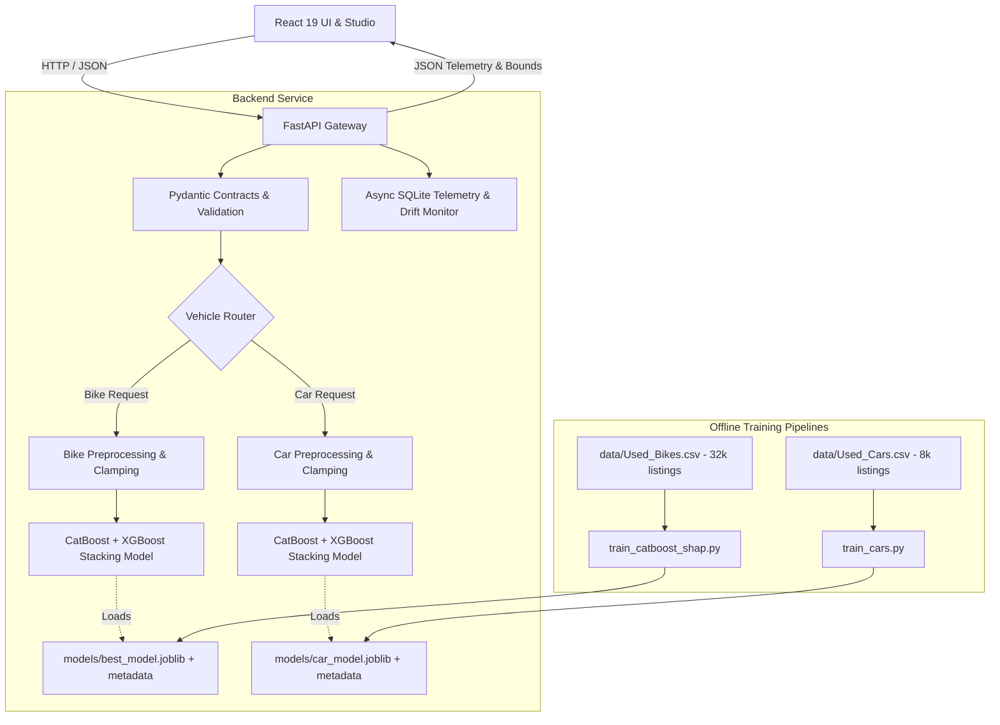

# System Overview

AutoValuate AI is a production-grade automotive ML platform designed for transparency, determinism, and operational resilience. Rather than just serving point predictions, the system actively guards against Out-of-Distribution (OOD) data, emits structured operational telemetry, calculates empirical confidence intervals ($\pm 1.28 \times \text{RMSE}$), projects 5-year depreciation schedules, monitors real-time population stability drift (PSI), provides historical price band percentiles, and executes multi-year vehicle lifecycle and Total Cost of Ownership (TCO) simulations.

## High-Level Architecture

The platform consists of five primary layers:

1. **Client UI (React 19 / Tailwind v4 / Framer Motion / Vite)**: A responsive, dark-obsidian frontend supporting Single Vehicle Valuation, Multi-Class Side-by-Side Comparison, Ownership Lifecycle & TCO Simulator with Web Audio sound synthesis, Enterprise Fleet Batch Appraisal, Market Price Trends, and MLOps Telemetry Dashboard.
2. **API Gateway (FastAPI)**: The enterprise gateway handling schema validation (`src.contracts`), rate limiting (`slowapi`), constant-time authentication (`secrets.compare_digest`), structured request logging (`asgi_correlation_id`), and public zero-auth demo endpoints.
3. **Inference & Simulation Engine**: A thread-safe layer that dynamically routes between Motorcycle and Passenger Car stacking models, executing predictions across CatBoost and XGBoost pipelines with real-market economic bounds clamping and multi-year TCO financial ledgers.
4. **MLOps & Telemetry Layer**: Asynchronous SQLite persistence (`src.database`), Population Stability Index (PSI) drift monitoring against training reference distributions (`src.monitoring`), and zero-downtime model hot-reloading (`POST /admin/reload-models`).
5. **Training & Retraining Pipelines**: Deterministic offline pipelines (`src/train_catboost_shap.py`, `src/train_cars.py`, `src/retrain.py`) cleaning raw datasets (`data/Used_Bikes.csv`, `data/Used_Cars.csv`), extracting derived polynomial/ratio features, and generating versioned artifacts (`best_model.joblib`, `car_model.joblib`, `*.metadata.json`) with automated pre-training backups.

```mermaid
graph TD
    Client["React 19 UI & Studio"] -->|HTTP / JSON| API["FastAPI Gateway"]
    
    subgraph Backend Service
        API --> Contracts["Pydantic Contracts & Validation"]
        Contracts --> Router{"Vehicle Router"}
        Router -->|Bike Request| BikePipeline["Bike Preprocessing & Clamping"]
        Router -->|Car Request| CarPipeline["Car Preprocessing & Clamping"]
        
        BikePipeline --> BikeStacker["CatBoost + XGBoost Stacking Model"]
        CarPipeline --> CarStacker["CatBoost + XGBoost Stacking Model"]
        
        BikeStacker -.->|Loads| BikeArt["models/best_model.joblib + metadata"]
        CarStacker -.->|Loads| CarArt["models/car_model.joblib + metadata"]
        
        API --> Telemetry["Async SQLite Telemetry & Drift Monitor"]
    end
    
    subgraph Offline Training Pipelines
        BikeData["data/Used_Bikes.csv - 32k listings"] --> TrainBikes["train_catboost_shap.py"]
        CarData["data/Used_Cars.csv - 8k listings"] --> TrainCars["train_cars.py"]
        TrainBikes --> BikeArt
        TrainCars --> CarArt
    end
    
    API -->|JSON Telemetry & Bounds| Client
```

## Key Principles

- **Dual-Engine Determinism**: Distinct high-performance models for two-wheelers ($R^2 = 97.4\%$) and passenger cars ($R^2 = 97.3\%$) with reproducible seeds.
- **Metadata-Driven Inference**: The API does not hardcode feature boundaries; it dynamically reads acceptable ranges and OOD thresholds from `*.metadata.json` generated at training time.
- **Backward Compatibility**: Robust support for legacy storage keys, query parameters, container IDs, and vehicle aliases without breaking backward integrations.
- **Explainability over Extrapolation**: When presented with edge-case data, the system clamps inputs to empirical boundaries, produces bounded predictions, flags "Low Confidence", and provides a full waterfall breakdown of value drivers.
