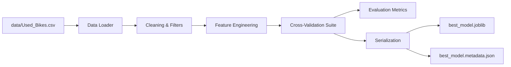

# Training Pipeline

The training pipeline transforms raw CSV data into a deterministic, deployment-ready serialized model.

## Pipeline Architecture

The pipeline consists of modular steps defined in `src.main` and `src.models`.

## 1. Data Cleaning
- Drops duplicate rows.
- Removes logically invalid data (e.g., age > 30 years).
- Trims statistical outliers using the Interquartile Range (IQR) method for price and kilometers driven.
- Filters out extremely rare brands (less than 10 occurrences) to prevent model overfitting on sparse categories.

## 2. Feature Engineering
- **Derived Metrics**: Creates composite features like `kms_per_year` and `power_per_year`.
- **Non-linear Transforms**: Generates `log_kms_driven` and `age_squared` to help linear sub-models capture non-linear relationships.

## 3. Modeling and Evaluation
The pipeline evaluates multiple algorithms using 5-fold cross-validation:
- Linear Models (Ridge, Lasso, LinearRegression)
- Tree Ensembles (RandomForest, GradientBoosting, XGBoost)
- **BlendEnsemble**: A custom VotingRegressor combining the best linear and tree models.

## 4. Metadata Serialization
A core design philosophy of this project is **Metadata-Driven Inference**.
Along with `best_model.joblib`, the pipeline dynamically computes the minimum and maximum boundaries of the training features and saves them as `best_model.metadata.json`. This ensures the API layer dynamically adapts to the exact dataset the model was trained on without hardcoded limits.
