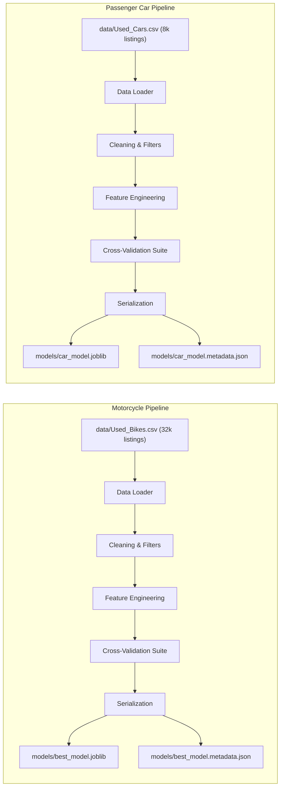

# Training Pipeline

The training pipelines transform raw CSV datasets into deterministic, deployment-ready serialized models. AutoValuate AI maintains two independent training pipelines — one for two-wheelers (motorcycles) and one for passenger cars.

## Pipeline Architecture

```mermaid
graph LR
    subgraph MotoPipe ["Motorcycle Pipeline"]
        BikeRaw["data/Used_Bikes.csv (32k listings)"] --> BikeLoader["Data Loader"]
        BikeLoader --> BikePreproc["Cleaning & Filters"]
        BikePreproc --> BikeEngineer["Feature Engineering"]
        BikeEngineer --> BikeCV["Cross-Validation Suite"]
        BikeCV --> BikeArt["Serialization"]
        BikeArt --> BikeJoblib["models/best_model.joblib"]
        BikeArt --> BikeMeta["models/best_model.metadata.json"]
    end

    subgraph CarPipe ["Passenger Car Pipeline"]
        CarRaw["data/Used_Cars.csv (8k listings)"] --> CarLoader["Data Loader"]
        CarLoader --> CarPreproc["Cleaning & Filters"]
        CarPreproc --> CarEngineer["Feature Engineering"]
        CarEngineer --> CarCV["Cross-Validation Suite"]
        CarCV --> CarArt["Serialization"]
        CarArt --> CarJoblib["models/car_model.joblib"]
        CarArt --> CarMeta["models/car_model.metadata.json"]
    end
```

## 1. Data Cleaning (`src/preprocessing.py`)
- Drops duplicate rows.
- Removes logically invalid data (e.g., age > 30 years).
- Trims statistical outliers using the Interquartile Range (IQR) method for price and kilometers driven.
- Filters out extremely rare brands (fewer than 10 occurrences) to prevent model overfitting on sparse categories.
- Normalizes owner labels to consistent integer rank encoding (`OWNER_LABEL_TO_RANK`).

## 2. Feature Engineering (`src/feature_engineering.py`)
- **Derived Metrics**: Creates composite features like `kms_per_year` and `power_per_year`.
- **Non-linear Transforms**: Generates `log_kms_driven` and `age_squared` to help sub-models capture non-linear depreciation curves.
- **Car-specific features**: `engine_cc`, `max_power_bhp`, `fuel`, and `transmission` are encoded for the car pipeline.

## 3. Modeling & Evaluation

### Motorcycle Pipeline (`src/train_catboost_shap.py`)
Trains a **CatBoost + XGBoost Stacking Ensemble** (`StackingEnsembleModel`):
- CatBoost handles categorical features natively (brand, owner type).
- XGBoost receives dummy-encoded features with `drop_first=False` and aligned column indexing.
- Weighted ensemble blending (default 60% CatBoost / 40% XGBoost).
- Achieves **R² ≈ 97.4%** on 5-fold cross-validation.

### Passenger Car Pipeline (`src/train_cars.py`)
Trains an equivalent **CatBoost + XGBoost Stacking Ensemble**:
- Additional categorical dimensions: fuel type, transmission type.
- Brand-specific engine displacement clamping via `CAR_BRAND_ENGINE_LIMITS`.
- Achieves **R² ≈ 97.3%** on 5-fold cross-validation.

## 4. Metadata Serialization
A core design philosophy is **Metadata-Driven Inference**. Along with `*.joblib` model artifacts, each pipeline dynamically computes the minimum and maximum boundaries of training features and saves them as `*.metadata.json`. This ensures the API layer dynamically adapts to the exact dataset each model was trained on, without hardcoded limits.

### Artifact Outputs
| Pipeline | Model Artifact | Metadata Artifact |
| :--- | :--- | :--- |
| Motorcycle | `models/best_model.joblib` | `models/best_model.metadata.json` |
| Passenger Car | `models/car_model.joblib` | `models/car_model.metadata.json` |
